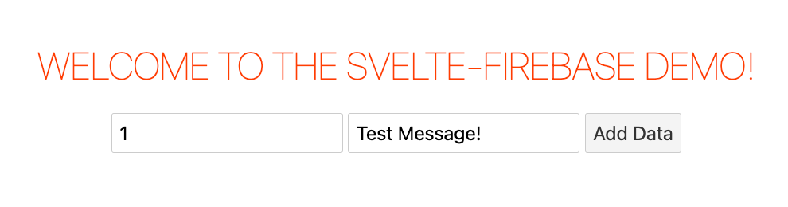
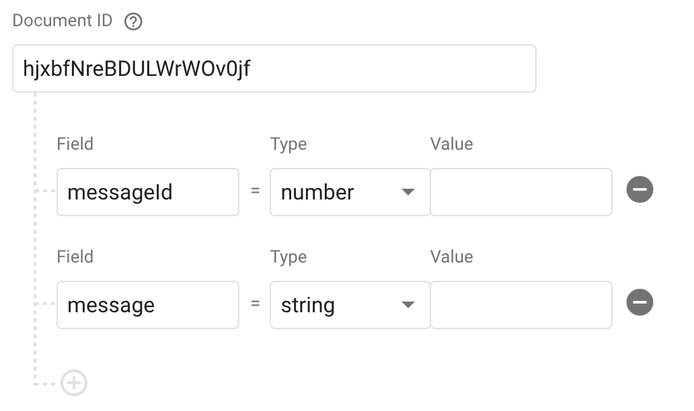

<!-- Begin README -->

<div align="center">
    <a href="https://github.com/scottgriv/svelte-firebase_demo" target="_blank">
        
    </a>
</div>
<p align="center">
    <a href="https://svelte.dev/"></a>
    <a href="https://firebase.google.com/"></a>
    <a href="https://nodejs.org/en/"></a>
    <br>
    <a href="https://github.com/scottgriv"></a>
    <a href="mailto:scott.grivner@gmail.com"></a>
    <a href="https://www.buymeacoffee.com/scottgriv"></a>
    <br>
    <a href="https://prgportfolio.com" target="_blank"></a>
</p>

---------------

<h1 align="center">🔥 Svelte Firebase Demo 🔥</h1>

A demo of app made using the **Svelte** JavaScript web framework and **Firebase Firestore** data storage service.

The **Three** main goals of this demo are to:
- How to get started with Svelte (installing, creating a project, running a server, etc.)
- Demonstrate how to integrate Firebase into a Svelte application.
- Demonstrate how to use Firebase Firestore to add data through a Svelte web application.

<div align="center">
    
    <br>
    <i>Application Preview</i>
</div>

-------

## Table of Contents

- [What is Svelte?](#what-is-svelte)
- [What is Firebase?](#what-is-firebase)
    - [Firestore](#firestore)
    - [Authentication](#authentication)
- [Getting Started](#getting-started)
    - [Installation](#installation)
    - [Usage](#usage)
    - [Notes](#notes)
- [Disclaimer](#disclaimer)
- [Resources](#resources)
- [License](#license)
- [Credits](#credits)

## What is Svelte?

Svelte is a JavaScript framework for building user interfaces. It is similar to React and Vue in that it uses a virtual DOM and component-based architecture. However, unlike React and Vue, Svelte does not use a virtual DOM at runtime. Instead, Svelte compiles your code into highly efficient vanilla JavaScript code that updates the DOM directly. This means that Svelte apps are smaller and faster than apps built with other frameworks.

## What is Firebase?

Firebase is a platform that provides a variety of services for building web and mobile apps. The services used in this demo are Firestore and Authentication.

### Firestore

Firestore is a NoSQL database that stores data in documents. Documents are stored in collections and can be queried using the Firebase SDK. Firestore is a good choice for this demo because it is easy to set up and use, and it is free for small projects.

### Authentication

Firebase Authentication provides a variety of authentication methods, including email/password, Google, Facebook, Twitter, and GitHub. It also provides a simple way to manage user accounts and passwords. Authentication is a good choice for this demo because it is easy to set up and use, and it is free for small projects.

## Getting Started

### Installation

1. Install [Node.js](https://nodejs.org/en/download/).
2. Install Svlete CLI with `npm install -g svelte-cli`.
3. Clone this repository.
4. Run `npm install` in the root directory of the project.
5. Install Firebase SDK in the root directory as well by running: `npm install firebase`.
6. Setting up Firebase:
Head to the Firebase Console:
    1. Create a new project (I named mine `svelte-firebase-demo` for example)
    2. Click on "Add App" and choose the "Web" option.
    3. Give your app a name and register it (I named mine `svelte-firebase_demo` for example).
    4. You'll then be provided with a configuration object that looks something like:
    ```javascript
    var firebaseConfig = {
    apiKey: "YOUR_API_KEY",
    authDomain: "YOUR_PROJECT_ID.firebaseapp.com",
    databaseURL: "https://YOUR_PROJECT_ID.firebaseio.com",
    projectId: "YOUR_PROJECT_ID",
    storageBucket: "YOUR_PROJECT_ID.appspot.com",
    messagingSenderId: "YOUR_MESSAGING_SENDER_ID",
    appId: "YOUR_APP_ID"
    };
    ```
7. Integrate Firebase in Svelte:
Firebase gets initlized in the `src/firebase.js` file but it needs the `firebaseConfig` configuration object from the Firebase console. Create a new file called `src/firebaseConfig.js`. and paste the `firebaseConfig` variable in the file from the previous step. Be sure to add the word `export` before the `firebaseConfig` variable in `src/firebaseConfig.js` so that it can be imported in `src/firebase.js`.
8. Create a collection called `firebase_demo` and add a document with the following fields:
    - `messageId` (number)
    - `message` (string)
    
    <br>
    <div align="center">
        <a href="" target="_blank">
            
        </a>
        <br>
        <i>Example Document Structure.</i>
    </div>
    <br>

    - For your document ID, you can use the `messageId` field or you can use the auto-generated ID (Auto-ID) feature.
    - Feel free to create your own collection and document structure, just be sure to update the code in `src/AddData.svelte` to reflect your collection name and document structure accordingly.
9. Run server with `npm run dev` and navigate to [localhost:8080](http://localhost:8080).
10. Firebase Authentication (optional):
If you wish to use Firebase authentication, you need to go to the Firebase Console, navigate to the Authentication section, and enable the desired sign-in methods.

### Usage

- Enter a `messageId` (any number, this is not a key in the database) and `message` (any text) in the input fields and click the "Add Data" button to add data to the Firestore database.
- Log into Firebase and navigate to the Firestore section to see the data you added.

### Notes

For more advance Svelte applications (outside of a simple Single Page Applications - SPA), I'd suggest using [SvelteKit](https://kit.svelte.dev/). SvelteKit is a framework for building web applications of all sizes, with a beautiful development experience and flexible filesystem-based routing. 

Another good resource for Svelte and Firebase is [SvelteFire](https://github.com/codediodeio/sveltefire). SvelteFire is a collection of official Svelte bindings for Firebase. It includes bindings for Firebase Authentication, Cloud Firestore, Realtime Database, Storage, and Cloud Messaging. It also includes a collection of utilities for working with Firebase and Svelte.

## Disclaimer

This application serves as a simple example of how to integrate Firebase into a Svelte application. It is not intended to be a complete application, but rather a starting point for building your own application. Feel free to modify it as you see fit.

## Resources

- [Svelte](https://svelte.dev/) - The official Svelte website.
- [Firebase](https://firebase.google.com/) - The official Firebase website.
- [Node.js](https://nodejs.org/en/) - Node.js is a JavaScript runtime built on Chrome's V8 JavaScript engine (used by Svelte for development).
- [Rollup](https://rollupjs.org) - Rollup is a module bundler for JavaScript which compiles small pieces of code into something larger and more complex, such as a library or application (used by Svelte for building).
- [degit](https://github.com/Rich-Harris/degit) - degit is a scaffolding tool that allows you to clone a git repository without the entire git history (used by Svelte for project creation).
- [sirv](https://github.com/lukeed/sirv) - sirv is a lightweight server that allows you to serve static files (used by Svelte for development).
- [Visual Studio Code](https://code.visualstudio.com/) - VS Code is a free code editor from Microsoft.
- [Svelte for VS Code](https://marketplace.visualstudio.com/items?itemName=svelte.svelte-vscode) - Svelte for VS Code is an extension that provides syntax highlighting, code completion, and other features for Svelte.
- [SvelteKit](https://kit.svelte.dev/) - SvelteKit is a framework for building web applications of all sizes, with a beautiful development experience and flexible filesystem-based routing.
- [SvelteFire](https://github.com/codediodeio/sveltefire) - SvelteFire is a collection of official Svelte bindings for Firebase. It includes bindings for Firebase Authentication, Cloud Firestore, Realtime Database, Storage, and Cloud Messaging. It also includes a collection of utilities for working with Firebase and Svelte.

## License

This project is released under the terms of the **MIT License**, which permits use, modification, and distribution of the code, subject to the conditions outlined in the license.
- The [MIT License](https://choosealicense.com/licenses/mit/) provides certain freedoms while preserving rights of attribution to the original creators.
- For more details, see the [LICENSE](LICENSE) file in this repository. in this repository.

## Credits

**Author:** [Scott Grivner](https://github.com/scottgriv) <br>
**Email:** [scott.grivner@gmail.com](mailto:scott.grivner@gmail.com) <br>
**Website:** [scottgrivner.dev](https://www.scottgrivner.dev) <br>
**Reference:** [Main Branch](https://github.com/scottgriv/svelte-firebase_demo) <br>

---------------

<div align="center">
    <a href="https://scottgrivner.dev" target="_blank">
        
    </a>
</div>

<!-- End README -->
